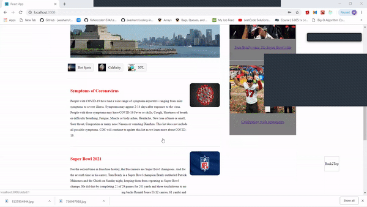

# Blog-Webpage-React-Redux


<!--- These are examples. See https://shields.io for others or to customize this set of shields. You might want to include dependencies, project status and licence info here --->


The blog is an online informational website that allows user to search and share with the latest posts. The goal of this project is using JavaScript to build an online informational website that displaying information in a good way. It uses JavaScript famous library React and state container Redux. It has the basic structure of the average blog, which are header, detail pages and sidebars. There is a very interesting search function in the header, which can search the most popular terms in the site. It also has the capability of Login and Logout. 
Although this project did not fully implement the message function of a blog, its structure, the search function inside the webpage and using Redux to manage `states`, laid a good foundation for the development of larger projects.


## Function
- [x] Login Management
- [x] Top Search
- [x] Change Search Contents
- [x] Article details page display
- [x] Loading more
- [x] Back to top 


## Technology Stack
- [x] react
- [x] react-redux
- [x] react-router
- [x] redux-thunk
- [x] styled-components
- [x] redux-immutable
- [x] immutable
- [x] axios
- [x] loadable


## Project operation effect
- Main Page


- Login/Logout


- Search


- Article details page display


- Loading more



- Back2Top


## Environment
```
node @12.18.4
```

## Run
```
npm start or yarn start
```

Add run commands and examples you think users will find useful. Provide an options reference for bonus points!


## Contact

If you want to contact me you can reach me at <hc740@scarletmail.rutgers.edu>


